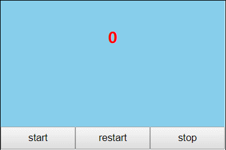

# IdoTimer
一个requestAnimationFrame优先的时间线javascript库， 

settimeout任务被放入异步队列，只有当主线程任务执行完后才会执行队列中的任务，因此实际执行时间总是比设定时间要晚；2、settimeout的固定时间间隔不一定与屏幕刷新时间相同，会引起丢帧。

**requestAnimationFrame：**优势：由系统决定回调函数的执行时机。60Hz的刷新频率，那么每次刷新的间隔中会执行一次回调函数，不会引起丢帧，不会卡顿

**requestAnimationFrame优势**：

- **CPU节能：**使用setTimeout实现的动画，当页面被隐藏或最小化时，setTimeout 仍然在后台执行动画任务，由于此时页面处于不可见或不可用状态，刷新动画是没有意义的，完全是浪费CPU资源。而requestAnimationFrame则完全不同，当页面处理未激活的状态下，该页面的屏幕刷新任务也会被系统暂停，因此跟着系统步伐走的requestAnimationFrame也会停止渲染，当页面被激活时，动画就从上次停留的地方继续执行，有效节省了CPU开销。
-  **函数节流：**在高频率事件(resize,scroll等)中，为了防止在一个刷新间隔内发生多次函数执行，使用requestAnimationFrame可保证每个刷新间隔内，函数只被执行一次，这样既能保证流畅性，也能更好的节省函数执行的开销。

**兼容性问题**，本插件优先使用requestAnimationFrame，再根据浏览器不同情况进行回退，直到只能使用setTimeout

## 集成

```bash
npm install ido-timer
```

## 使用

```javascript
var timer = new IdoTimer();
timer.callback = function(time) {
    console.log(time)
};
// start方法不传参数，默认每隔16.67ms回调一次callback方法
timer.start()
```

停止

```javascript
timer.stop();
```

重新开始

```javascript
timer.restart();
```



## API

| 名称     | 参数                             | 说明                                                         |
| -------- | -------------------------------- | ------------------------------------------------------------ |
| start    | interval : 单位ms,默认值为16.7ms | 开始，每隔interval时间，IdoTimer会执行一次callback方法，并将当前的执行的时间间隔在callback中以参数的形式返回。 |
| stop     | —                                | 停止                                                         |
| restart  | —                                | 在上次停止的地方重新开始                                     |
| callback | time                             | 定时器时间回调，从开始到当前执行的时间                       |

## 变更记录

1.0.0

- 【Initial】初始版本